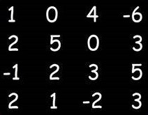

# 2D Arrays

It is similar to 2D matrices that we studied in 11th and 12th class.<br>

1. Creating a 2D Array - with new keyword
   `int[][] marks = new int[3][3];`<br>

2. Taking a matrix as an input and printing its elements.

```
import java.util.*;

public class TwoDArrays {
   public static void main(String args[]) {
       Scanner sc = new Scanner(System.in);
       int rows = sc.nextInt();
       int cols = sc.nextInt();

       int[][] numbers = new int[rows][cols];

       //input
       //rows
       for(int i=0; i<rows; i++) {
           //columns
           for(int j=0; j<cols; j++) {
               numbers[i][j] = sc.nextInt();
           }
       }

       for(int i=0; i<rows; i++) {
           for(int j=0; j<cols; j++) {
                   System.out.print(numbers[i][j]+" ");
               }
               System.out.println();
           }
    }
}
```

3. Searching for an element x in a matrix.

```
import java.util.*;

public class TwoDArrays {
   public static void main(String args[]) {
       Scanner sc = new Scanner(System.in);
       int rows = sc.nextInt();
       int cols = sc.nextInt();

       int[][] numbers = new int[rows][cols];

       //input
       //rows
       for(int i=0; i<rows; i++) {
           //columns
           for(int j=0; j<cols; j++) {
               numbers[i][j] = sc.nextInt();
           }
       }

       int x = sc.nextInt();

       for(int i=0; i<rows; i++) {
           for(int j=0; j<cols; j++) {
               //compare with x
               if(numbers[i][j] == x) {
                   System.out.println("x found at location (" + i + ", " + j + ")");
               }
           }
       }
   }
}
```

# Difficult Level

1. Print the spiral order matrix as output for a given matrix of numbers.

```
import java.util.*;

public class Arrays {
    public static void main(String args[]) {
        Scanner sc = new Scanner(System.in);
        int n = sc.nextInt();
        int m = sc.nextInt();

        int matrix[][] = new int[n][m];
        for (int i = 0; i < n; i++) {
            for (int j = 0; j < m; j++) {
                matrix[i][j] = sc.nextInt();
            }
        }

        System.out.println("The Spiral Order Matrix is : ");
        int rowStart = 0;
        int rowEnd = n - 1;
        int colStart = 0;
        int colEnd = m - 1;

        // To print spiral order matrix
        while (rowStart <= rowEnd && colStart <= colEnd) {
            // 1
            for (int col = colStart; col <= colEnd; col++) {
                System.out.print(matrix[rowStart][col] + " ");
            }
            rowStart++;

            // 2
            for (int row = rowStart; row <= rowEnd; row++) {
                System.out.print(matrix[row][colEnd] + " ");
            }
            colEnd--;

            // 3
            for (int col = colEnd; col >= colStart; col--) {
                System.out.print(matrix[rowEnd][col] + " ");
            }
            rowEnd--;

            // 4
            for (int row = rowEnd; row >= rowStart; row--) {
                System.out.print(matrix[row][colStart] + " ");
            }
            colStart++;

            System.out.println();
        }
    }
}
```

Eg:  <br>
The Spiral order is given by:<br>
1 0 4 -6 3 5 3 -2 1 2 -1 2 5 0 3 2 3<br>
**APPROACH :** <br>
Algorithm: (We are given a 2D matrix of n X m ).<br>

1. We will need 4 variables:
   a. row_start - initialized with 0.
   b. row_end - initialized with n-1.
   c. column_start - initialized with 0.
   d. column_end - initialized with m-1.
2. First of all, we will traverse in the row row_start from column_start to column_end and we will increase the row_start with 1 as we have traversed the starting row.
3. Then we will traverse in the column column_end from row_start to row_end and decrease the column_end by 1.
4. Then we will traverse in the row row_end from column_end to column_start and decrease the row_end by 1
5. Then we will traverse in the column column_start from row_end to row_start and increase the column_start by 1.
6. We will do the above steps from 2 to 5 until row_start <= row_end and column_start <= column_end.
   <br><br>

7. For a given matrix of N x M, print its transpose.

```
import java.util.*;;

public class Arrays {
    public static void main(String args[]) {
        Scanner sc = new Scanner(System.in);
        int n = sc.nextInt();
        int m = sc.nextInt();

        int matrix[][] = new int[n][m];
        for (int i = 0; i < n; i++) {
            for (int j = 0; j < m; j++) {
                matrix[i][j] = sc.nextInt();
            }
        }

        System.out.println("The transpose is : ");
        // To print transpose
        for (int j = 0; j < m; j++) {
            for (int i = 0; i < n; i++) {
                System.out.print(matrix[i][j] + " ");
            }
            System.out.println();
        }

    }
}
```

<br>

**Output:**

